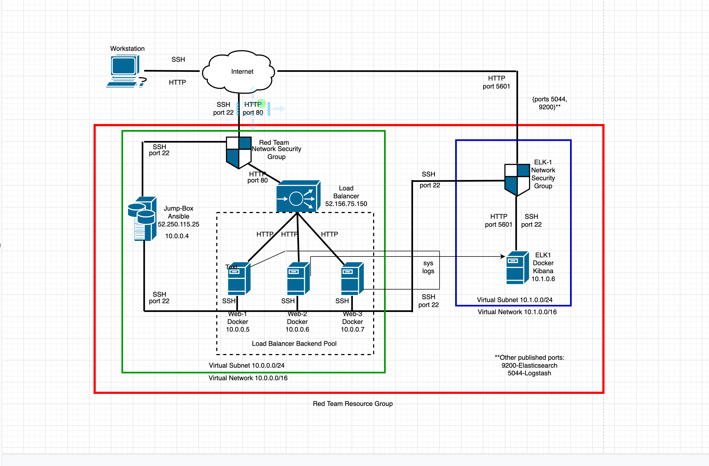
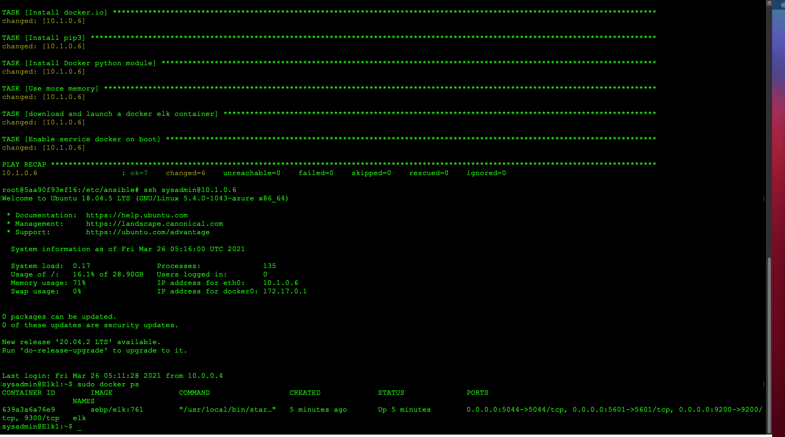

# elk-stack-project1
ELK Stack configuration

## Automated ELK Stack Deployment

The files in this repository were used to configure the network depicted below.

These files have been tested and used to generate a live ELK deployment on Azure. They can be used to either recreate the entire deployment pictured above. Alternatively, $

  - _TODO:Ansible/elk-playbook.yml

This document contains the following details:
- Description of the Topology
- Access Policies
- ELK Configuration
  - Beats in Use
  - Machines Being Monitored
- How to Use the Ansible Build

### Description of the Topology

The main purpose of this network is to expose a load-balanced and monitored instance of DVWA, the D*mn Vulnerable Web Application.

Load balancing ensures that the application will be highly available, in addition to restricting inbound access to the network.
- _TODO: Load balancers protect against attacks that flood a system with traffic. These attacks are called Distributed Denial of Service or DDoS.
The advantage of a jump box What is the advantage of a jump box?_

Integrating an ELK server allows users to easily monitor the vulnerable VMs for changes to the network and system metrics.
- _TODO: What does Filebeat watch for? Filebeat watches for any changes or events on the VMs and monitors log files.
- _TODO: What does Metricbeat record? Metricbeat collects metrics and statistics and takes them to the output that you select.

The configuration details of each machine may be found below.
_Note: Use the [Markdown Table Generator](http://www.tablesgenerator.com/markdown_tables) to add/remove values from the table_.

| Name     | Function | IP Address | Operating System |
|----------|----------|------------|------------------|
| Jump Box | Gateway  | 10.0.0.4   | Linux            |
| ELK      | Server   | 10.1.0.6   | Linux            |
| Web-1    | Server   | 10.0.0.5   | Linux            |
| Web-2    | Server   | 10.0.0.6   | Linux            |
| Web-3    | Server   | 10.0.0.7   | Linux            |

### Access Policies

The machines on the internal network are not exposed to the public Internet.
Only the jump box machine can accept connections from the Internet. Access to this machine is only allowed from the following IP addresses:
- _TODO: 73.170.150.55

Machines within the network can only be accessed by each other.
- _TODO: The Jump Box VM is the machine that can connect with the Elk server. Its ip address is: 52.250.115.25._

A summary of the access policies in place can be found in the table below.

| Name     | Publicly Accessible | Allowed IP Addresses |
|----------|---------------------|----------------------|
| Jump Box | Yes/No              | 73.170.150.55        |
| ELK      | No                  | 10.0.0.1-254         |
| Web-1    | No                  | 10.0.0.1-254         |
| Web-2    | No                  | 10.0.0.1-254         |
| Web-3    | No                  | 10.0.0.1-154         |

### Elk Configuration

Ansible was used to automate configuration of the ELK machine. No configuration was performed manually, which is advantageous because...
- _TODO: automation allows repetitive commands to be executed with minimal errors therefore configuration is faster than if performed manually. This allows Ansible to
configure multiple servers at the same time.

The playbook implements the following tasks:
- _TODO: In 3-5 bullets, explain the steps of the ELK installation play. E.g., install Docker; download image; etc._
- Install docker.io
- Install python-pip
- Install docker
- Launch docker container

The following screenshot displays the result of running `docker ps` after successfully configuring the ELK instance.

### Target Machines & Beats
This ELK server is configured to monitor the following machines:
- _TODO: Web-1:10.0.0.5 Web-2:10.0.0.6 Web-3:10.0.0.7

We have installed the following Beats on these machines:
- _TODO: Filebeat and Metricbeat

These Beats allow us to collect the following information from each machine:
- _TODO: Filebeat generates log files and will collect any information that has been changed in the system being monitored such as syslogs. Metricbeat collects quantitativ$
(statistics) of different activities such as the number failed login attempts, system data (CPU/RAM usage), and attempts to escalate privileges.

### Using the Playbook
In order to use the playbook, you will need to have an Ansible control node already configured. Assuming you have such a control node provisioned:

SSH into the control node and follow the steps below:
- Copy the ______ file to the ______.
- Update the host file to include the ...
- Run the playbook, and navigate to ________  to check that the installation worked as expected.

_TODO: Answer the following questions to fill in the blanks:_
- _Which file is the playbook? Where do you copy it? The .yml such as elk1-playbook.yml is the playbook. It is copied to the Ansible Control Node.
- _Which file do you update to make Ansible run the playbook on a specific machine?_ Hosts file.
- _How do I specify which machine to install the ELK server on versus which to install Filebeat on?_You need to modify the file by adding the specific ip address of the ma$
- _Which URL do you navigate to in order to check that the ELK server is running?_ curl http://10.1.0.6:5601

_As a **Bonus**, provide the specific commands the user will need to run to download the playbook, update the files, etc._
Copy and Download the Playbook:
cd /etc/ansible
mkdir files
git clone https://github.com/username/elk-stack-project-1.git

Move Playbooks and hosts file into /etc/ansible:
cp elk-stack-project-1/playbooks/* .
cp elk-stack-project-1/files/* ./files

Update host file:
cd /etc/ansible
hosts
[webservers]
10.0.0.5
10.0.0.6
10.0.0.7

[elk]
10.1.0.6

Run the playbook:
cd /etc/ansible
ansible-playbook elk-playbook.yml

